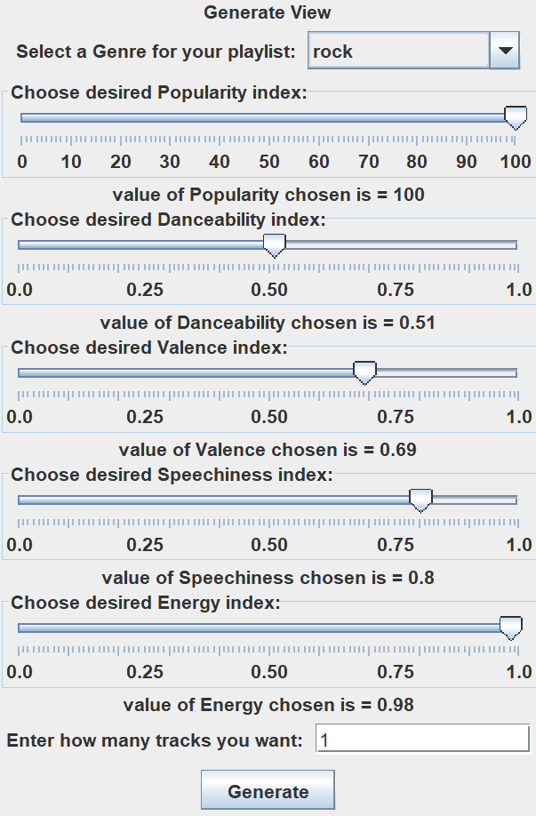
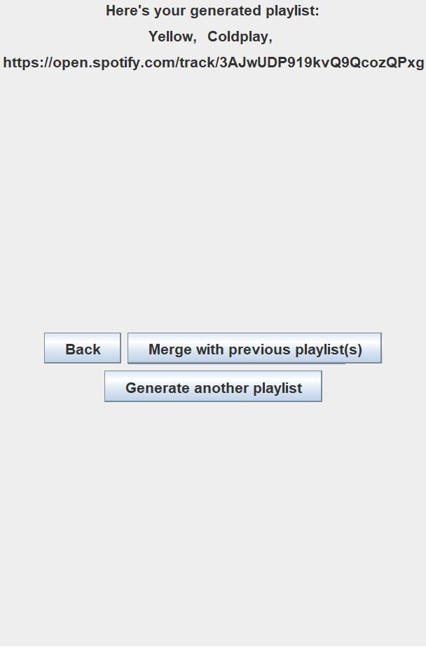
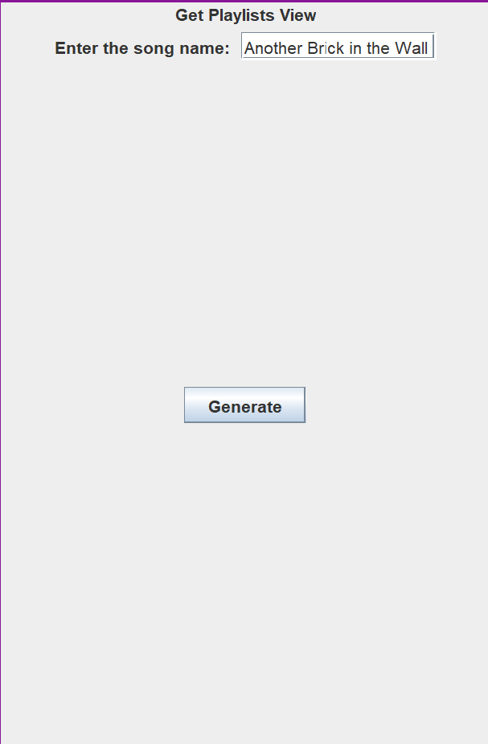
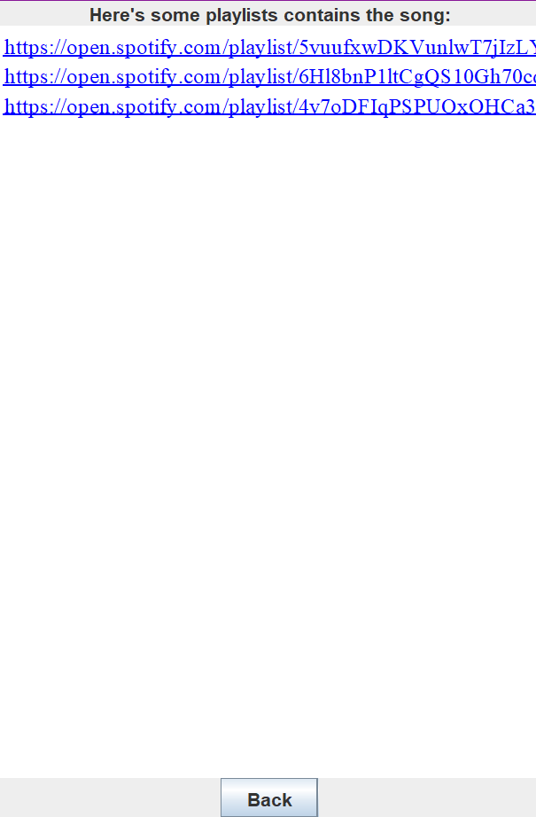

# group-project
My group and I built a Playlist Generating App, which primarily creates playlists based on a users input from pre-existing buttons. 

See our presentation for more information: https://docs.google.com/presentation/d/1pBjLJTrQPYfTkW1AhUy87dEwT5gQVG1V8piGybNC4Ag/edit#slide=id.g262bf0d1203_0_1746

For example if you wanted to get a single track with the following filters, it would look like this: 

This provides and stores the track info for the user to store. In the future, we hope to save this to a user's spotify account.

Another cool feature we added was the "getSimilarPlaylist" which returns 3 pre-existing Spotify Playlists that are related to the song you put in. Here is an example:

with the following output:

Note: This uses the Spotify Search algorithm, so that the output is not always accurate. 

Note: Tokens necessary for generation expire every hour. If you would like to try this project, you will require a Spotify API token. If this project gets enough interest, we will allow users to link their accounts and bypass this.

The project is closed for now as we successfully acheived our objectives. If there is any feature you would like or to test out, please let me know!
